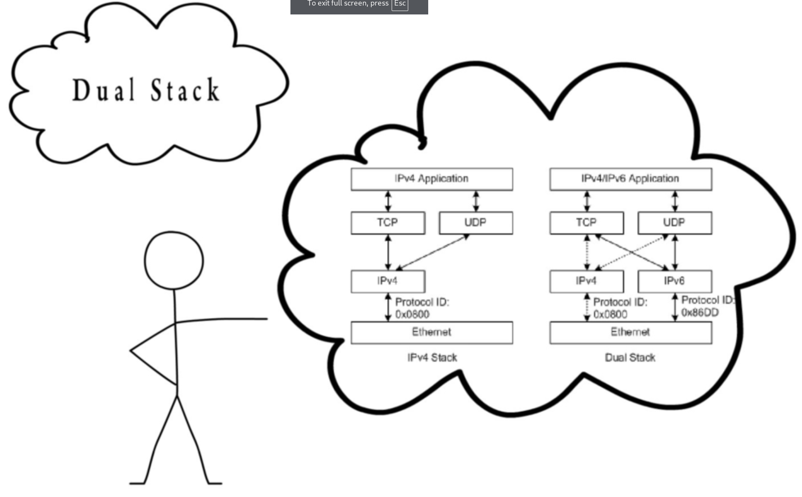
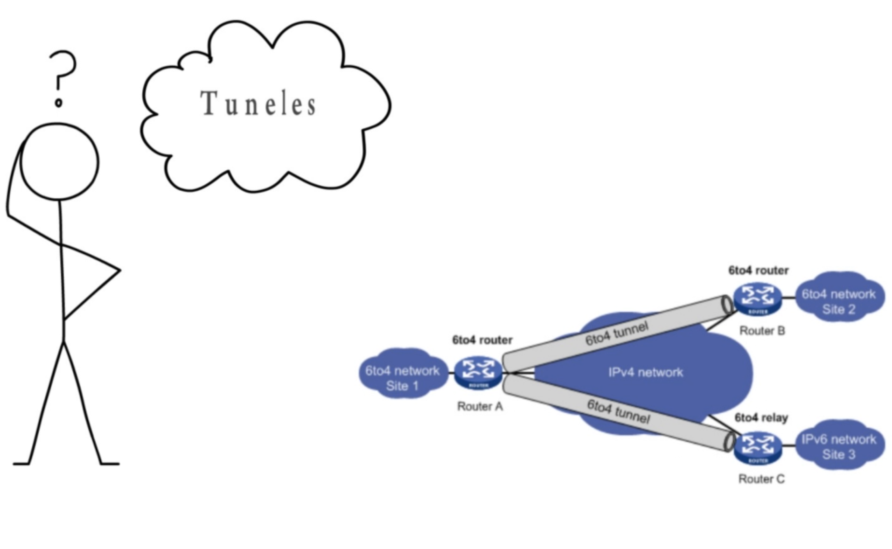
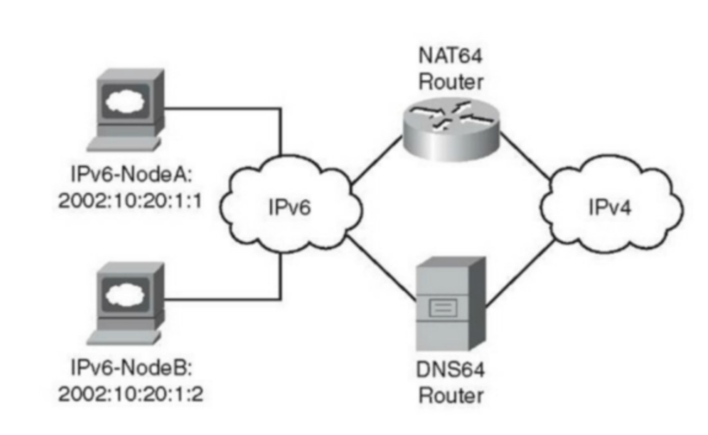

# Subnetting

## Introducción a IPv6

¿Por qué se pasó de IPv4 a IPv6 y se dejó de lado IPv5?  
En realidad, en teoría, sí existe IPv5, conocido como:

### Internet Stream Protocol Version 2 (ST2)  
Lo podemos encontrar en el `RFC 1819`

## Características

- **Cambio de Longitud**

  | Protocolo | Longitud |
  |-----------|----------|
  | IPv6      | 128 bits |
  | IPv4      | 32 bits  |

- **Comunicación Anycast**: Envía paquetes a un nodo que pertenece a un grupo de nodos.
- **Scope o Ámbito**
- **Simplificación de la cabecera**: Esto reduce el costo de procesamiento en nodos y routers.

# Comparación entre Encabezado IPv4 e IPv6

| Campo                       | IPv4                           | IPv6                           |
|-----------------------------|--------------------------------|--------------------------------|
| **Versión**                 | **Versión**                     | **Versión**                     |
| **IHL**                     | **IHL**                         |                                |
| **Tipo de Servicio**        | **Tipo de Servicio**            | **Traffic Class**               |
| **Longitud Total**          | **Longitud Total**              | **Payload Length**              |
| **Identificación**          | **Identificación**              |                                |
| **Flags**                   | **Flags**                       |                                |
| **Fragment Offset**         | **Fragment Offset**             |                                |
| **Tiempo de Vida**          | **Tiempo de Vida**              | **Hop Limit**                   |
| **Protocolo**               | **Protocolo**                   | **Next Header**                 |
| **Checksum de Encabezado**  | **Checksum de Encabezado**      |                                |
| **Dirección de Origen**     | **Dirección de Origen**         | **Dirección de Origen**         |
| **Dirección de Destino**    | **Dirección de Destino**        | **Dirección de Destino**        |
| **Opciones**                | **Opciones**                    |                                |
| **Padding**                 | **Padding**                     |                                |
|                             |                                | **Flow Label** (nuevo en IPv6) |

## Leyenda

- **Campos que se mantienen**: Nombres de campos que se mantuvieron de IPv4 a IPv6.
- **Campos que no se mantienen**: Campos que no se mantienen en IPv6.
- **Campos con nombre y posición cambiados**: Campos que cambiaron de nombre y/o posición en IPv6.
- **Campo nuevo en IPv6**: Campos nuevos en IPv6.

- **Etiqueta de Flujo para QoS**

  | Bits  | Campo               | Descripción                           |
  |-------|---------------------|---------------------------------------|
  | 0 - 4 | **Versión**         | Versión del protocolo (IPv6)          |
  | 4 - 12| **Traffic Class**   | Calidad de servicio (QoS)             |
  | 12 - 32| **Flow Label**      | Manejo de flujo de paquetes           |
  | 32 - 48| **Payload Length**  | Longitud del payload                  |
  | 48 - 56| **Next Header**     | Tipo de protocolo en el payload       |
  | 56 - 64| **Hop Limit**       | Límite de saltos (TTL en IPv4)        |
  | 64 - 192| **Dirección de Origen** | Dirección de origen (128 bits)    |
  | 192 - 320| **Dirección de Destino** | Dirección de destino (128 bits) |

- **Encabezados de Extensión:**

  | Orden | Tipo de Encabezado                              | Código de Encabezado Siguiente |
  |-------|-------------------------------------------------|--------------------------------|
  | 1     | Encabezado IPv6 Básico                          | -                              |
  | 2     | Opciones Hop-by-Hop                             | 0                              |
  | 3     | Opciones de Destino (con Opciones de Enrutamiento) | 60                             |
  | 4     | Encabezado de Enrutamiento                       | 43                             |
  | 5     | Encabezado de Fragmento                          | 44                             |
  | 6     | Encabezado de Autenticación                      | 51                             |
  | 7     | Encabezado de Carga Segura de Encapsulación      | 50                             |
  | 8     | Opciones de Destino                              | 60                             |
  | 9     | Encabezado de Movilidad                          | 135                            |
  |       | Sin encabezado siguiente                        | 59                             |
  | Capa Superior | TCP                                        | 6                              |
  | Capa Superior | UDP                                        | 17                             |
  | Capa Superior | ICMPv6                                     | 58                             |

IPv6 se compone de 128 bits y su nomenclatura es hexadecimal:  
8 bloques de 16 bits

La nomenclatura de 16 bits es la siguiente: `0123456789ABCDEF`

| Hexadecimal | Decimal | Binario |
|-------------|---------|---------|
| 0           | 1       | 0000    |
| 1           | 2       | 0001    |
| 2           | 3       | 0010    |
| 3           | 4       | 0011    |
| 4           | 5       | 0100    |
| 5           | 6       | 0101    |
| 6           | 7       | 0110    |
| 7           | 8       | 0111    |
| 8           | 9       | 1000    |
| 9           | 10      | 1001    |
| A           | 11      | 1010    |
| B           | 12      | 1011    |
| C           | 13      | 1100    |
| D           | 14      | 1101    |
| E           | 15      | 1110    |
| F           | 16      | 1111    |

**Ejemplo:**

- A7F1:
  - A = 1010
  - 7 = 0111
  - F = 1111
  - 1 = 0001

- D:
  - D = 1101

## Representación

En este ejemplo se observan distintas formas de representar:

- 2001:0000:0000:0000:0000:0000:0000:0001
  - 2001:0:0:0:0:0:0:1
    - 2001::1

### Reglas:

1. Los ceros a la izquierda se pueden omitir
  - 2001:0000:0000:0000:0000:0000:0000:0001
    - 2001:0:0:0:0:0:0:1
2. Bloques en 0 se pueden representar con un único 0
  - 2001:0:0:0:0:0:0:1
3. Bloques consecutivos en 0 se pueden representar con `::`, pero solo una vez en la dirección IP
  - 2001::1

**Ejemplo 2:**

- 2001:0000:0000:1111:0000:0000:0000:0001
  - 2001:0:0:1111::1

Los dos puntos `::` irán donde hay más ceros consecutivos.

## Direccionamiento IPv6

### Tipos de direcciones:

- **UNICAST:**
  - Son el identificador de una interfaz.
        
- **ANYCAST:**
  - Son el identificador para un conjunto de interfaces; los paquetes se entregan a la dirección IP más cercana según la métrica del protocolo.
    
- **MULTICAST:**
  - Es un identificador para un conjunto de interfaces; los paquetes se entregan a todas las interfaces con esta dirección.

### **OJO YA NO HAY BROADCAST EN IPv6 Y SU FUNCIÓN ES DELEGADA A MULTICAST**

- **UNSPECIFIED ADDRESS**
  - 0:0:0:0:0:0:0:0
    - No representa ningún nodo. Puede ser utilizado al iniciar cuando el host no sabe cuál es su propia dirección.
    - No es enrutada a través de Internet.
    - No se utiliza como dirección de destino.

- **LOOPBACK ADDRESS**
  - 0:0:0:0:0:0:0:1
    - Se utiliza como dirección de destino para verificación de forma local.
    - No es enrutada a través de Internet.

- **GLOBAL ADDRESS**
  - 2000-3FFF::/3
    - Son enrutables a través de Internet.
    - Aquí se subnetea sobre las subredes; no se subneatea el host como en IPv4.

  Porque tendremos 64 bits para red y 64 bits para host.

  Aquí no se tiene que ahorrar red; esta parte es administrativa y un punto de vista de gestión.

- **LINK LOCAL**
  - Son configuradas de forma automática.
  - No son enrutables a través de Internet.

- **UNIQUE LOCAL**
  - Direccionamiento privado `FC00`.

- **MULTICAST**
  - Identifica un grupo de interfaces en diferentes nodos, una interfaz puede tener varios identificadores para diferentes protocolos.

---

## Direcciones Globales

Rango 2000::/3 a 3FFF::/3

Un aspecto importante que siempre vamos a realizar el subneteo en el cuarto bloque porque los primeros 48 bits van a ser del (ISP, RIR, IANA) RIR = Regional Internet Registries

Subnet ID 16 bits

Para mayor información están:
- RFC 7020
- RFC 7029

## Tecnologías de Transición

- DualStack

- Tuneles

- Traducción

---

# Subneteo IPv6

| **Prefijo Global**  | 48 bits (proviene del ISP, RIR, IANA) |
|---------------------|---------------------------------------|
| **RIR**             | Regional Internet Registries          |
| **Subnet ID**       | 16 bits                               |

216 = 65,536 subredes

Ejemplo:

| Subredes |
|---------|
| 2001:1001:1001:0000 |
| 2001:1001:1001:0001 |
| 2001:1001:1001:0002 |
| 2001:1001:1001:0003 |
| 2001:1001:1001:0004 |
| 2001:1001:1001:FFFF |

### Paso 1: Definir el prefijo de red

216 = 65,536

| Potencia | Resultado |
|----------|-----------|
| 20  | 1         |
| 21  | 2         |
| 22  | 4         |
| 23  | 8         |
| 24  | 16        |
| 25  | 32        |
| 26  | 64        |
| 27  | 128       |
| 28  | 256       |
| 29  | 512       |
| 210 | 1,024     |
| 211 | 2,048     |
| 212 | 4,096     |
| 213 | 8,192     |
| 214 | 16,384    |
| 215 | 32,768    |

Subredes

| #   | Representación Binaria | Hexadecimal |
|-----|------------------------|-------------|
| 1   | 1111 1111 1111 1100   | FFFC        |
| 2   | 1111 1111 1111 1101   | FFFD        |
| 3   | 1111 1111 1111 1110   | FFFE        |
| 4   | 1111 1111 1111 1111   | FFFF        |

**Caso 2:** Necesitamos encontrar 16 subredes o configurar 16 subredes distintas.

| Potencia | Resultado |
|----------|-----------|
| 20  | 1         |
| 21  | 2         |
| 22  | 4         |
| 23  | 8         |

La suma es 16 bits

| #   | Representación Binaria | Hexadecimal |
|-----|------------------------|-------------|
| 1   | 1111 1111 1111 0000   | FFF0        |
| 2   | 1111 1111 1111 0001   | FFF1        |
| 3   | 1111 1111 1111 0010   | FFF2        |
| 4   | 1111 1111 1111 0011   | FFF3        |
| 5   | 1111 1111 1111 0100   | FFF4        |
| 6   | 1111 1111 1111 0101   | FFF5        |
| 7   | 1111 1111 1111 0110   | FFF6        |
| 8   | 1111 1111 1111 0111   | FFF7        |
| 9   | 1111 1111 1111 1000   | FFF8        |
| 10  | 1111 1111 1111 1001   | FFF9        |
| 11  | 1111 1111 1111 1010   | FFFA        |
| 12  | 1111 1111 1111 1011   | FFFB        |
| 13  | 1111 1111 1111 1100   | FFFC        |
| 14  | 1111 1111 1111 1101   | FFFD        |
| 15  | 1111 1111 1111 1110   | FFFE        |
| 16  | 1111 1111 1111 1111   | FFFF        |

**Caso 3:**
- Tenemos la dirección IP:
  - 2001:1:1:1:x::/48

¿Cuál sería el hexadecimal de la subred 8888?

En este caso, comenzamos desde 215.

| Potencia | Resultado | Binario |
|----------|-----------|---------|
| 215 | 32,768    | 0       |
| 214 | 16,384    | 0       |
| 213 | 8,192     | 1       |
| 212 | 4,096     | 0       |
| 211 | 2,048     | 0       |
| 210 | 1,024     | 0       |
| 29  | 512       | 1       |
| 28  | 256       | 0       |
| 27  | 128       | 1       |
| 26  | 64        | 0       |
| 25  | 32        | 1       |
| 24  | 16        | 1       |
| 23  | 8         | 1       |
| 22  | 4         | 0       |
| 21  | 2         | 0       |
| 20  | 1         | 0       |

En hexadecimal sería:

| Representación Binaria | Hexadecimal |
|------------------------|-------------|
| 0010 0010 1011 1000   | 22B8        |

Así encontramos una subred específica dentro de las 65,536 subredes.
